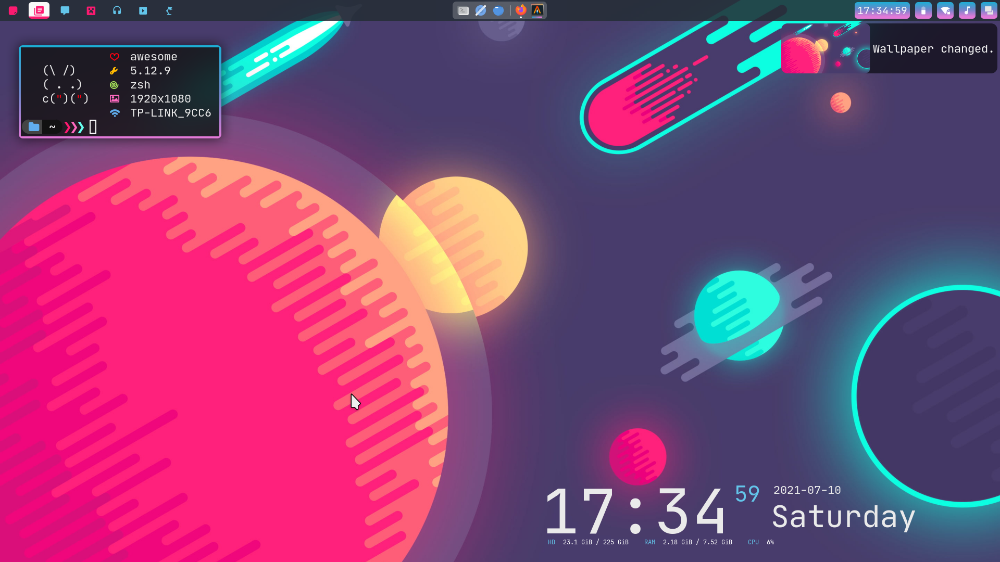
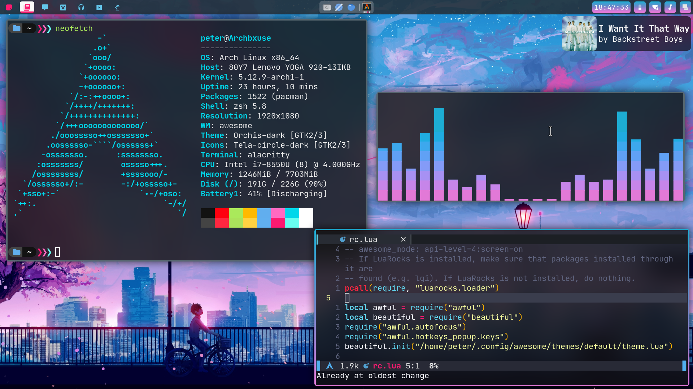
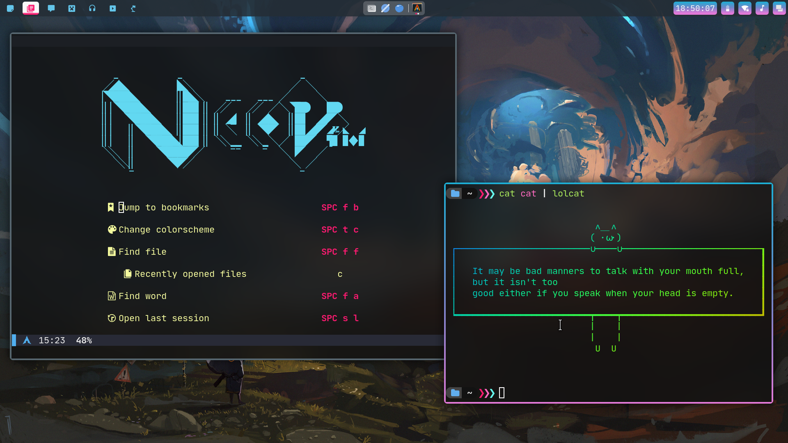

# Welcome to my dotfiles!


- **Window Manager**                      : awesome-git
- **Display Manager**                     : lightdm(litarvan theme)
- **Shell**                               : zsh
- **Text Editor/IDE**                     : neovim-nightly-bin
- **Terminal Emulator**                   : alacritty(ligature fork)
- **Window Compositor**                   : [Picom](https://github.com/yshui/picom)
- **File Manager**                        : Ranger/Thunar





# Awesomewm patch for more aesthetic notification icon size
The naughty.widget.icon automatically sets its width and height the same. To change it so that it fits the normal aspect ratio, inside lib/naughty/widget/icon.lua, replace 

```lua
        return optimal, optimal
``` 
with 
```lua 
        if w < h then
            return optimal, optimal / w * h
        elseif w >= h then
            return optimal / h * w, optimal
        end
```


